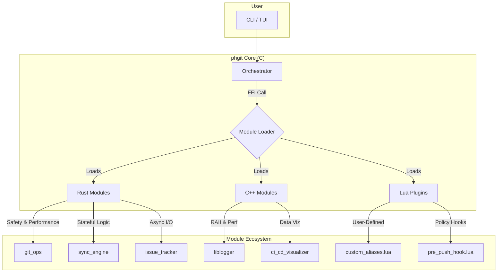

 <!-- Enhanced README header for phgit -->
<div align="center" style="font-family: -apple-system, BlinkMacSystemFont, 'Segoe UI', Roboto, 'Helvetica Neue', Arial, system-ui; max-width:900px; margin:0 auto; padding:1.2rem 0;">

  <a href="https://github.com/phkaiser13/peitchgit" aria-label="Ir para o repositório Ph Git" style="text-decoration:none; color:inherit;">
    <!-- Use SVG quando disponível (melhor qualidade). PNG/ICO como fallback. -->
    <picture>
      <source type="image/svg+xml" srcset="/.github/forrepo/icon/icon.svg">
      <source type="image/png" srcset="/.github/forrepo/icon/icon.png">
      <!-- Último fallback: .ico -->
      
    </picture>
  </a>

  <h1 style="font-size:2.25rem; margin:0 0 0.2rem; line-height:1.05;">📖 Ph Git <small style="font-size:.6em; color:#666; margin-left:.5rem;">(Peitch Git)</small></h1>

  <p style="font-size:1.05rem; color:#444; margin:0 0 0.8rem;">
    <em>The Polyglot Assistant for Git & DevOps Workflows</em>
  </p>

  <p style="max-width:760px; font-size:0.98rem; line-height:1.5; color:#333; margin:0 auto 0.8rem;">
    Ferramenta de linha de comando de alta performance (C/C++/Rust) que vai além do Git: orquestra workflows complexos de desenvolvimento e DevOps com uma interface unificada, extensível e super rápida.
  </p>

  <!-- Badges -->
  <p style="margin:0.6rem 0 0;">
    <a href="https://github.com/phkaiser13/peitchgit/releases/latest" style="margin-right:6px;">
      
    </a>
    <a href="https://github.com/phkaiser13/peitchgit/blob/main/LICENSE" style="margin-right:6px;">
      
    </a>
    <a href="https://github.com/phkaiser13/peitchgit/actions" style="margin-right:6px;">
      
    </a>
    <a href="https://github.com/phkaiser13/peitchgit/graphs/contributors">
      
    </a>
  </p>
</div>


## Table of Contents

  - [Documentation](docs/introduction.md)
  - [What is `phgit`?](https://www.google.com/search?q=%23what-is-phgit)
  - [Key Features](https://www.google.com/search?q=%23-key-features)
  - [Architectural Principles](https://www.google.com/search?q=%23-architectural-principles)
  - [Why `phgit`? More Than a Git Wrapper](https://www.google.com/search?q=%23-why-phgit-more-than-a-git-wrapper)
  - [Getting Started](https://www.google.com/search?q=%23-getting-started)
      - [Prerequisites](https://www.google.com/search?q=%23prerequisites)
      - [Building from Source](https://www.google.com/search?q=%23building-from-source)
  - [Usage Showcase](https://www.google.com/search?q=%23-usage-showcase)
  - [Extending with Lua: Your Workflow, Your Rules](https://www.google.com/search?q=%23-extending-with-lua-your-workflow-your-rules)
  - [Roadmap](https://www.google.com/search?q=%23-roadmap)
  - [Contributing](https://www.google.com/search?q=%23-contributing)
  - [License](https://www.google.com/search?q=%23-license)

## What is `phgit`?

`phgit` is an extensible command-line framework engineered to be the central nervous system for your development lifecycle. It provides a robust C core that dynamically orchestrates a suite of modules written in **Rust** and **C++**. This polyglot design isn't a gimmick; it's a deliberate choice to use the best language for each task, from memory-safe, critical logic in Rust to high-performance, object-oriented components in C++.

The result is a tool that is not only fast and safe but also deeply extensible through a **Lua scripting engine**, allowing you to bend `phgit` to your will without ever touching the core source.

## ✨ Key Features

  - ⚙️ **Stateful Repository Synchronization**: Go beyond simple mirroring. The `sync-engine` module uses `git2-rs` for direct Git object database analysis, enabling a stateful, bi-directional sync that can safely detect commit divergence and prevent data loss.
  - 🛠️ **Seamless DevOps Orchestration**: Automate your Infrastructure-as-Code and secret management workflows. Directly execute tools like Terraform (`tf-plan`) and read from Vault (`vault-read`), with output intelligently streamed or captured and parsed.
  - 🔌 **Zero-Cost Extensibility with Lua**: Embed custom logic directly into the application's lifecycle. Create command aliases, or implement powerful `on_pre_push` hooks to lint code, check policies, or run tests before your code ever leaves your machine.
  - 📡 **Asynchronous API Clients**: Interact with external services like GitHub Issues without blocking the UI. The `issue_tracker` module is built on Rust's `tokio` runtime for responsive, non-blocking network I/O.
  - 🖥️ **Dual CLI & TUI**: Use `phgit` as a powerful tool in your automated scripts or launch it without arguments to enter an interactive Text-based UI that dynamically lists all available commands from every loaded module.
  - 📦 **Use as a Library**: The modular architecture means components like the thread-safe C++ logger can be integrated into other projects. The core API contract allows any of the modules to be used by other C-ABI compatible applications.

## 🏛️ Architectural Principles

`phgit` is built on a modular, message-passing architecture where a C core orchestrates isolated components via a stable Foreign Function Interface (FFI).



  - **C (The Orchestrator)**: The core is written in C for maximum portability and low-level control over the dynamic loading of modules via a C-ABI contract (`phgit_core_api.h`).
  - **C++ (High-Performance Libraries)**: Used for components where Object-Oriented design and RAII (Resource Acquisition Is Initialization) provide significant advantages, such as in the thread-safe `Logger` and the `PipelineVisualizer`.
  - **Rust (Mission-Critical Logic)**: The language of choice for all modules where memory safety, performance, and correctness are non-negotiable. The `sync_engine`, `issue_tracker`, and `devops_automation` modules leverage Rust's powerful type system and fearless concurrency to handle complex tasks reliably.
  - **Lua (User-Level Scripting)**: Embedded directly into the core to provide a safe, sandboxed, and easy-to-use extension mechanism for end-users, enabling true workflow customization.

## 🤔 Why `phgit`? More Than a Git Wrapper

While `phgit` provides convenient Git commands, its true power lies in what it does *beyond* standard Git operations.

1.  **Orchestration, Not Just Aliasing**: `phgit` doesn't just run shell commands. Modules like `sync_engine` and `issue_tracker` perform complex, stateful operations and interact with network services asynchronously. The `devops_automation` module parses structured data from CLI tools, turning them into first-class citizens of your workflow.
2.  **Safety and Performance by Design**: By using Rust for critical modules, `phgit` provides compile-time guarantees against entire classes of bugs (e.g., data races, null pointer dereferences), ensuring stability. The C++ components leverage RAII for deterministic resource management.
3.  **A True Developer Platform**: Because of its modular design, `phgit` is a platform. You can write your own modules in Rust or C++ to integrate proprietary tools, connect to internal APIs, or implement complex logic, all while benefiting from the core's orchestration capabilities.

## 🚀 Getting Started

### Prerequisites

You need a C/C++ compiler, `cmake`, `rustc`, and `cargo`. Development headers for `lua` and `libcurl` are also required.

We provide a script to help install these on most systems:

```bash
# On Linux and macOS
./scripts/setup_dev_env.sh
```

### Building from Source

The project uses CMake, but a simple `Makefile` wrapper provides convenient commands.

```bash
# 1. Clone the repository
git clone https://github.com/phkaiser13/peitchgit.git
cd peitchgit

# 2. Build the project
make
# Or: ./scripts/build.sh

# 3. Run it!
./build/bin/phgit
```

## 💻 Usage Showcase

#### The "One-Shot" Send

Automate the tedious `add -> commit -> push` cycle. `phgit` intelligently handles cases where there's nothing to commit.

```bash
# Stage, commit, and push all changes with one command
./build/bin/phgit SND
```

#### Read a Vault Secret Cleanly

No more piping to `jq`. The `devops_automation` module captures and parses JSON output for you.

```bash
# Reads a secret and displays it as clean key-value pairs
./build/bin/phgit vault-read secret/data/prod/api-keys
```

#### Bi-Directional Repository Sync

Perform a safe, stateful sync between two local repositories, with protection against accidental data loss from branch divergence.

```bash
# Run a sync, which creates a state file in ./source-repo/.git/
./build/bin/phgit sync-run ./source-repo ./target-repo
```

## 🔌 Extending with Lua: Your Workflow, Your Rules

Add your own commands and hooks by dropping `.lua` files into the `src/plugins/` directory.

#### Example 1: Custom Aliases

Create `src/plugins/my_aliases.lua` to tailor `phgit` to your muscle memory.

```lua
-- File: src/plugins/my_aliases.lua

-- Create a short alias 'st' for the 'status' command
-- Allows you to run 'phgit st' instead of 'phgit status'
phgit.register_alias("st", "status")

-- Log to the main phgit log file to confirm loading
phgit.log("INFO", "Loaded custom alias 'st'.")
```

Now, `phgit st` works just like `phgit status`.

#### Example 2: Enforce Team Policy with a Pre-Push Hook

Create `src/plugins/policy.lua` to prevent common mistakes, like pushing to `main`.

```lua
-- File: src/plugins/policy.lua

-- This global function is automatically called by the phgit core before a push
function on_pre_push(remote, branch)
    if branch == "main" then
        print("[POLICY] Direct pushes to the main branch are forbidden.")
        print("Please use a pull request workflow.")
        return false -- This cancels the entire push operation
    end
    -- Allow pushes to any other branch
    return true
end
```

This hook system is a powerful way to integrate linters, run tests, or enforce any workflow rule before code is shared.

## 🗺️ Roadmap

`phgit` is an actively developing platform. Here are some of the features on our horizon:

  - [ ] **IDE Integration**: A dedicated plugin for VS Code and JetBrains IDEs (IntelliJ, CLion, etc.) to expose `phgit` commands and TUI elements directly within the editor.
  - [ ] **Graphical Frontends**: The modular architecture allows for the creation of alternative GUIs (e.g., using GTK, Qt, or web technologies) that can use the core modules as a backend library.
  - [ ] **Expanded DevOps Support**: Adding modules for interacting with Docker, Kubernetes (`kubectl`), and other cloud provider CLIs.
  - [ ] **More Issue Tracker Integrations**: Adding support for Jira, GitLab Issues, and others.
  - [ ] **Configuration Auto-Discovery**: Automatically finding and loading project-specific `.phgit.conf` files.

## 🤝 Contributing

Contributions are the lifeblood of open source. We welcome bug reports, feature requests, and pull requests\! Please see our [**Contributing Guide**](https://www.google.com/search?q=CONTRIBUTING.md) for details on how to get started, and feel free to use our [issue templates](https://www.google.com/search?q=.github/ISSUE_TEMPLATE/) for bug reports and feature requests.

## 📜 License

`phgit` is distributed under the terms of the Apache License 2.0.

See [LICENSE](https://www.google.com/search?q=LICENSE) for more information.
