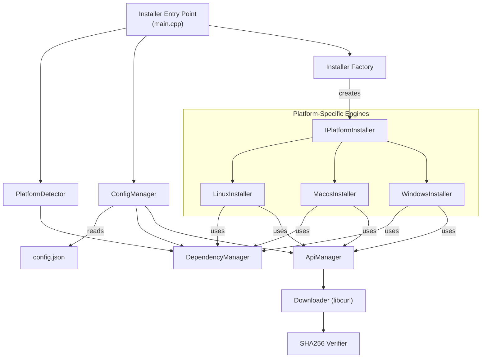

<div align="center" style="font-family:Segoe UI, Roboto, sans-serif;">
  <a href="https://github.com/phkaiser13/peitchgit"></a>

  <h1 style="font-size:2.5em; margin-bottom:0.2em;">⚙️ Ph Git Installer Engine</h1>
  <p style="font-size:1.2em; color:#555; margin-top:0;">
    <em>A Data-Driven, Cross-Platform Installer for Modern Tooling</em>
  </p>

  <p style="max-width:700px; font-size:1.05em; line-height:1.5em; color:#444;">
    This is the core engine for the <code>phgit</code> installer. It is a standalone, high-performance C++ application designed to provide a robust and intelligent installation experience across Windows, macOS, and various Linux distributions.
  </p>


</div>

## Table of Contents

* [What is the Installer Engine?](#what-is-the-installer-engine)
* [Key Features](#key-features)
* [Architectural Principles](#architectural-principles)
* [How It Works](#how-it-works)
* [Building the Installer](#building-the-installer)
* [Configuration (config.json)](#configuration-configjson)
* [Contributing](#contributing)
* [License](#license)

## What is the Installer Engine?

The `phgit` installer is more than just a script that copies files. It's an intelligent C++ application responsible for the post-installation or standalone setup of the `phgit` toolchain. It is designed to be the smart core inside native packages (like DEB, RPM, MSI) or to be run as a standalone executable, handling tasks that require logic and network access, such as dependency validation and dynamic component downloads.

## ✨ Key Features

* 🌐 **Cross-Platform by Design**: A single C++ codebase with platform-specific modules to handle the nuances of **Windows**, **macOS**, and major **Linux** distribution families (Debian, Fedora, Arch).
* ⚙️ **Data-Driven Configuration**: The installer's behavior is defined by `config.json`, not hardcoded. This allows for easy updates to dependencies, API endpoints, and metadata without recompiling the engine.
* 🚀 **Dynamic Dependency Management**: Automatically detects required tools like Git, Terraform, and Vault. If they are missing or outdated, it can fetch and install them from their official sources.
* 📡 **Live API Integration**: Communicates with external APIs (GitHub Releases, HashiCorp) to fetch the latest versions and checksums for dependencies, ensuring users always get up-to-date and secure components.
* 🛡️ **Robust and Secure**: Performs SHA256 checksum verification on all downloaded files to ensure integrity and prevent corruption or tampering.
* 📦 **Flexible Installation Strategies**: Leverages native package managers (`apt`, `dnf`, `brew`) when available, with a robust fallback to installing from a `.tar.gz` or `.pkg` for maximum compatibility.

## 🏛️ Architectural Principles

The installer is built on a modular, object-oriented architecture that separates concerns, making it easy to maintain and extend.



* **`main.cpp`**: The application entry point that orchestrates the entire process.
* **`ConfigManager`**: Parses `config.json` to load all necessary metadata and settings.
* **`PlatformDetector`**: Identifies the OS, version, and architecture to guide the installation logic.
* **`DependencyManager`**: Checks for the presence and version of required external tools.
* **`ApiManager` & `Downloader`**: Work together to fetch release metadata and download artifacts from the web.
* **`IPlatformInstaller`**: An interface that defines the contract for platform-specific installation logic, implemented by `WindowsInstaller`, `LinuxInstaller`, and `MacosInstaller`.

## ⚙️ How It Works

The installer follows a clear, sequential process:

1. **Load Configuration**: The engine starts by reading `config.json` to understand what it needs to do.
2. **Detect Platform**: It identifies the host system's OS, architecture, and privilege level.
3. **Check Dependencies**: It verifies that all required tools (like Git) are installed and meet the minimum version requirements specified in the configuration.
4. **Instantiate Engine**: Based on the detected platform, it creates the appropriate engine (e.g., `LinuxInstaller` on Ubuntu).
5. **Run Installation**: The platform-specific engine executes its strategy:

   * It may call out to a native package manager (`apt`, `dnf`) to install missing dependencies.
   * If a dependency is not available in the package manager or if running in standalone mode, it uses the `ApiManager` and `Downloader` to fetch the official release, verifies its checksum, and installs it.
   * It performs necessary system integration, such as updating the system `PATH`.

## 🚀 Building the Installer

The installer is built with CMake and requires a C++17 compiler.

### Prerequisites

* A C++17 compliant compiler (GCC, Clang, MSVC)
* CMake (version 3.16 or newer)
* `libcurl` development headers
* `spdlog` and `nlohmann/json` (these are fetched automatically by CMake via `FetchContent`)

### Build Steps

The installer is a subproject of the main `phgit` build. It can be built from the root of the `phgit` repository.

```bash
# 1. Configure the project with CMake
# (from the root phgit directory)
cmake -S . -B build -DPHGIT_BUILD_INSTALLER=ON

# 2. Build the project
cmake --build build

# 3. The executable will be available at:
# build/bin/phgit-installer
```

## 📜 Configuration (`config.json`)

The heart of the installer is the `config.json` file, which defines its behavior.

* **`package_metadata`**: Contains information like the application name and version, used for registry entries and package metadata.
* **`dependencies`**: A list of required and optional command-line tools, each with a name and minimum required version.
* **`api_endpoints`**: Defines the URLs and parameters needed to query release APIs (like GitHub and HashiCorp) for dynamic downloads.

This data-driven approach allows the installer to be easily adapted to new versions of `phgit` or its dependencies without changing a single line of C++ code.

## 🤝 Contributing

This installer engine is a core part of the `phgit` ecosystem. Contributions are welcome! Please see the main [**Contributing Guide**](CONTRIBUTING.md) for details on how to get started.

## 📜 License

The `phgit` Installer Engine is distributed under the terms of the Apache License 2.0.

See [LICENSE](LICENSE) for more information.
